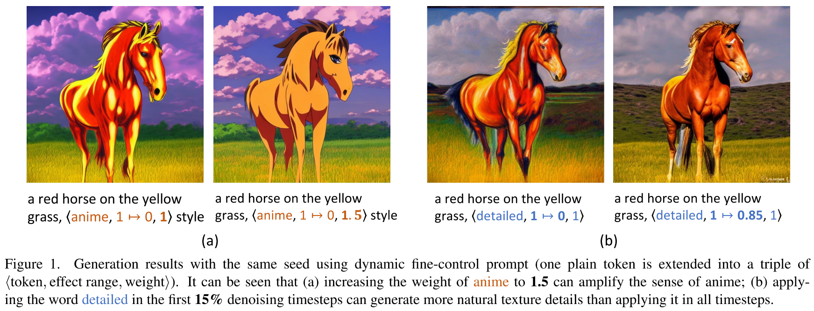
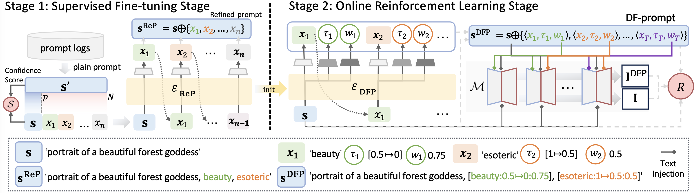
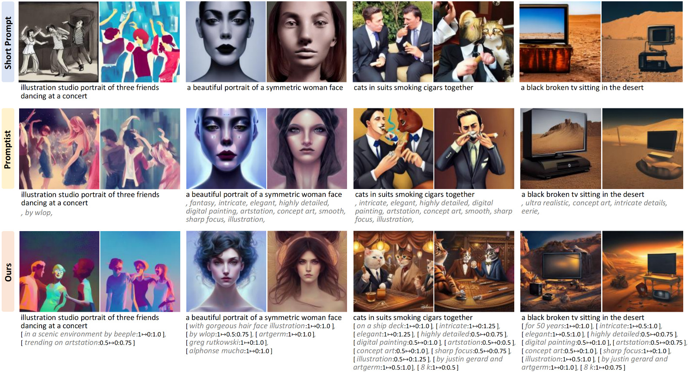

### Dynamic Prompt Optimization for Text-to-Image Generation (CVPR24)


<a href='https://arxiv.org/abs/2404.04095'></a> 
[](https://github.com/Mowenyii/PAE)

##  Abstract

<details><summary>CLICK for the full abstract</summary>


> Text-to-image generative models, specifically those based on diffusion models like Imagen and Stable Diffusion, have made substantial advancements. Recently, there has been a surge of interest in the delicate refinement of text prompts.
Users assign weights or alter the injection time steps of certain words in the text prompts to improve the quality of generated images. 
However, the success of fine-control prompts depends on the accuracy of the text prompts and the careful selection of weights and time steps, which requires significant manual intervention. 
To address this, we introduce the **P**rompt **A**uto-**E**diting (PAE) method. 
Besides refining the original prompts for image generation, we further employ an online reinforcement learning strategy to explore the weights and injection time steps of each word, leading to the dynamic fine-control prompts. 
The reward function during training encourages the model to consider aesthetic score, semantic consistency, and user preferences. 
Experimental results demonstrate that our proposed method effectively improves the original prompts, generating visually more appealing images while maintaining semantic alignment. 
</details>


##  Setup Environment

```bash
conda create -n PAE python=3.8
conda activate PAE
# First, install PyTorch 1.12.1 (or later) and torchvision, and then install other dependencies.
pip install -r requirements.txt
```

`xformers` is recommended for A800 GPU to save memory and running time. 


Our environment is similar to minChatGPT [official](https://github.com/ethanyanjiali/minChatGPT). You may check them for more details.


## Weight Download

To use our model, please download the following weight file and follow the instructions for setup.
```bash
cd ckpt/PAE
bash download.sh
```


## Demo
```
# generate DF-prompts only
python demo_DF_prompt.py


# generate the images according to DF-prompts only 
# ["a red horse on the yellow grass, anime style",
#     "a red horse on the yellow grass, [anime:0-1:1.5] style",
#     "a red horse on the yellow grass, detailed",
#     "a red horse on the yellow grass, [detailed:0.85-1:1]"]
python demo_Image.py 
```
 


## Data 

### Training Data 

You can download the training data from the following link:
[Download](https://drive.google.com/file/d/12j_Oah0sUzpIRWcmGP8-y9AN6lWJoeC6/view?usp=drive_link)


### Evaluate Data

The evaluation datasets are provided as NumPy files and are stored in the `data` directory of this repository. The following datasets are available:

- `COCO_test_1k.npy`: This is a test dataset from the COCO dataset, consisting of 1,000 prompts.
- `diffusiondb_test_1k.npy`: This test dataset is from the DiffusionDB, and it contains 1,000 test prompts.
- `lexica_test_1k.npy`: The Lexica test dataset comprises 1,000 prompts for evaluation.


## Train

 

#### Stage 1:

To execute the training script `train_stage_1.py`, use the following command line arguments:

1. `-n`: Experiment name.
2. `-card`: Specify the GPU to use with `cuda:{card}` format.
3. `-b`: Batch size.
4. `-t`: Number of iterations.


Example command:

```
python train_stage_1.py -n your_experiment_name -card 0 -b 64 -t 1e6 
```


#### Stage 2:


To run the training script `train_stage_2.py`, use the following command line options:


1. `-n`: Experiment name.

2. `-card`: Specifies the GPU card to use.

3. `-e`: Number of epochs.

4. `-b`: Batch size.

5. `-a`: Path to the policy model to load, which is the model trained during the first stage.

6. `-c`: Path to the value model to load, which is also the model trained during the first stage.

7. **Output**: The trained model after a specified number of steps will be saved under the `runs` directory.

Example command:

```
python -u train_stage_2.py -n your_experiment_name --card 0 -e 500 -b 32 -a your_ckpt_path -c your_ckpt_path
```


## Evaluation

### CMMD (Rethinking FID: Towards a Better Evaluation Metric for Image Generation, [official](https://github.com/google-research/google-research/tree/master/cmmd))

#### 1. Install other dependencies
```bash
pip install git+https://github.com/google-research/scenic.git

cd cmmd
pip install -r requirements.txt
```

#### 2. Download the results of PAE and Promptist and reference images in COCO dataset and put them in directory named "save".
```
your_project_root/
├── save/
    ├── coco_PAE/
    ├── coco_promptist/
    ├── coco_image_data/
    ...
```


|Type | Name     | Download Link |
|----|------------------|---------------|
|eval images| coco_PAE | [Download](https://drive.google.com/file/d/10LvwYwHYADm2LZaVVPougJjSkLNWqBpy/view?usp=drive_link) |
|eval images| coco_promptist   | [Download](https://drive.google.com/file/d/1DCmVommxmWYW6Mt8HubbYNba_atphmAm/view?usp=drive_link) |
|reference images| coco_image_data  | [Download](https://drive.google.com/file/d/1GVv5nVqGa-Uatf1dUHrLsuPECIbuZmzF/view?usp=drive_link) |


#### 3. CMMD calculation

Example command:

```
# evaluate PAE
python -m cmmd.main save/coco_image_data save/coco_PAE --batch_size=32 --max_count=1000

# evaluate promptist
python -m cmmd.main save/coco_image_data save/coco_promptist --batch_size=32 --max_count=1000
```

### Other metrics

To generate dynamic prompts and their corresponding images, and subsequently compute various metrics, use the script `evaluate.py` as follows:

```
python evaluate.py
```

Command Line Options:

1. `--card`: Specifies the GPU card to use.
2. `--data`: The dataset to use for evaluation.
3. `--save`: The path to save the generated images.
4. `--ckpt`: The path to the trained policy model checkpoint.


Example command:

```
python evaluate.py --card 0 --data "coco" --save "save/coco/" --ckpt "ckpt/PAE/actor_step3000.pt"
```


## Results
 


## 📍 Citation 

```
@misc{mo2024dynamic,
      title={Dynamic Prompt Optimizing for Text-to-Image Generation}, 
      author={Wenyi Mo and Tianyu Zhang and Yalong Bai and Bing Su and Ji-Rong Wen and Qing Yang},
      year={2024},
      eprint={2404.04095},
      archivePrefix={arXiv},
      primaryClass={cs.CV}
}
``` 

